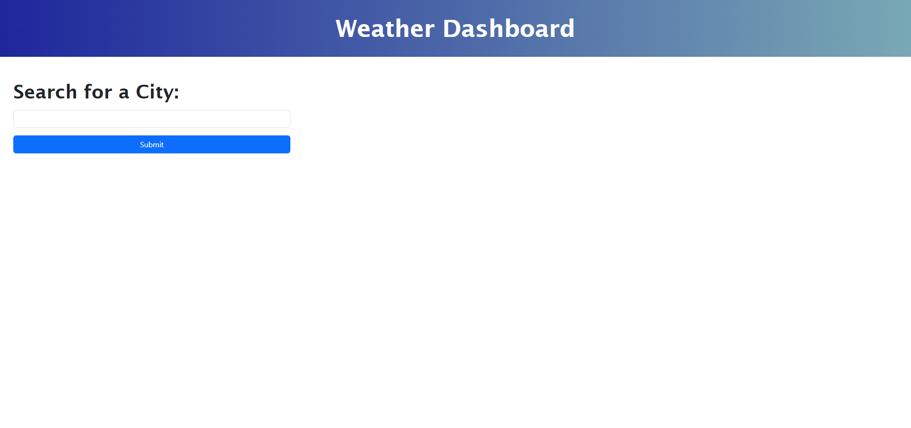

# weather-dashboard

## Description

In this challenge, I was asked to build a weather dashboard that will run in the browser and feature dynamically updated HTML and CSS. The application should show the current weather, a 5 day weather forecast and a search history of previously searched cities that are displayed as buttons. When clicked, the past search city should display the current weather and forecast by using local storage. The API was given for this project. 

## Table of Contents 

Please refer to Table Of Contents.
- [Criteria](#criteria)
- [Screenshot](#screenshot)
- [Link To Deployed Application](#link-to-deployed-application)

## Criteria

USER STORY

-AS A traveler
-I WANT to see the weather outlook for multiple cities
-SO THAT I can plan a trip accordingly

ACCEPTANCE CRITERIA

-GIVEN a weather dashboard with form inputs
-WHEN I search for a city
-THEN I am presented with current and future conditions for that city and that city is added to the search history
-WHEN I view current weather conditions for that city
-THEN I am presented with the city name, the date, an icon representation of weather conditions, the temperature, the humidity, and the the wind speed
-WHEN I view future weather conditions for that city
-THEN I am presented with a 5-day forecast that displays the date, an icon representation of weather conditions, the temperature, the wind speed, and the humidity
-WHEN I click on a city in the search history
-THEN I am again presented with current and future conditions for that city

Notes: I was not able to complete the challenge and looking forward to complete the assignment at a later time to re-submit it. 

## Screenshot 

Please reference the gif and photos for the Weather Dashboard Project.

## Link To Deployed Application

Please refer to deployed application directly:

[Weather Dashboard](https://susorocode.github.io/work-day-scheduler/)